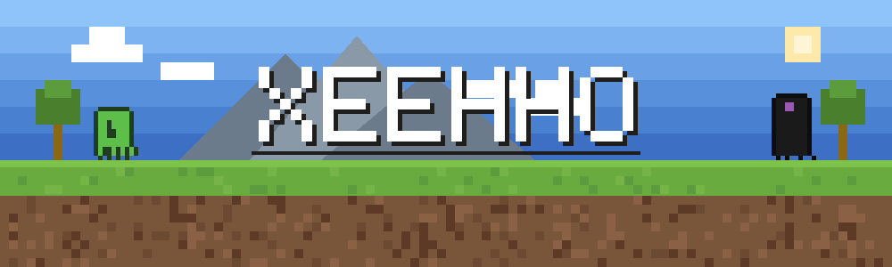

  

### 关于我

个人游戏独立开发者，正在使用 Godot 引擎开发独立游戏 **KufuWorld**（进行中），一人承担玩法设计、程序开发与资源管线。

写游戏之余也写工具：技术底色是跨端前端（React / Taro / TypeScript）与 AI 应用工程（Python / LangChain / LangGraph），擅长把工程化与 AI 工作流引入独立开发，一个人跑完从设计到发布的全流程。

热门插件库 **dsh-web-ui** 贡献者之一，深度参与皮肤中心 / Wallpaper Engine 壁纸模块的架构修复。

### 正在开发 / Now Building

 
一款用 Godot 引擎从零打造的独立游戏，代码全程公开。

### 开源贡献 / Open Source

<table>
  <tr>
    <td>
      
       
      热门社区插件库 · 皮肤中心 / 壁纸引擎模块
        
      <b>已合并的代表性 PR：</b>
       
      <a href="https://github.com/zhu1090093659/dsh-web-ui/pull/793">#793</a> 场景提取缓存版本化 —— 修复插件升级后旧缓存不失效导致的壁纸显示异常
       
      <a href="https://github.com/zhu1090093659/dsh-web-ui/commits?author=Xeehho">→ 查看全部提交</a>
    </td>
  </tr>
</table>

### 技术栈 / Tech Stack

  
  
  
  
  
   
  
  
  

  
  

