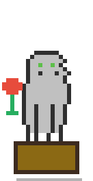
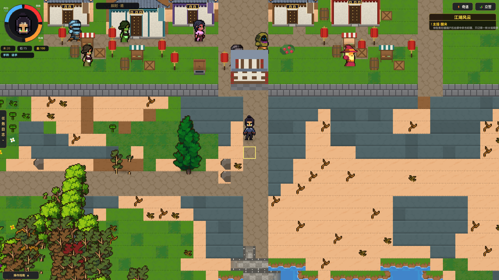
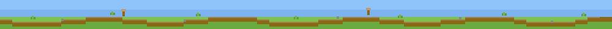
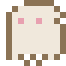

  
  
  
  
  

### 关于我

个人游戏独立开发者，正在使用 Godot 引擎开发独立游戏 **KufuWorld**（进行中），一人承担玩法设计、程序开发与资源管线。

写游戏之余也写工具：技术底色是跨端前端（React / Taro / TypeScript）与 AI 应用工程（Python / LangChain / LangGraph），擅长把工程化与 AI 工作流引入独立开发，一个人跑完从设计到发布的全流程。

热门插件库 **dsh-web**（原 dsh-web-ui）与桌面端 **dsh-desktop** 贡献者之一，深度参与皮肤中心 / Wallpaper Engine 壁纸模块的架构修复。

### 正在开发 / Now Building

  
  

一款用 Godot 引擎从零打造的 2D 武侠 RPG：气候驱动的程序化开放世界，一个人 = 玩法 + 程序 + 资源管线。

 

▲ 青石城南门：坊市 / 城墙 / 山地荒野一图同框（实机截图，世界与贴图全部程序化生成）

  

<b>开发进度 / Progress（2026-09）</b>

 

| 模块 | 状态 |
|------|------|
| 程序化世界：气候七群系 · 河流水文 · 山口垭口可行域规划 | ✅ |
| 唐制城池「青石城」· 四门官道 · 7 村镇三模板 · 5 门派领地 | ✅ |
| 战斗：三架势 / 连招树 / 破绽反击 + 18 武学 + 6 内功五行相克 | ✅ |
| 任务告示板 / 20 种奇遇 / 誓约 / 供求定价商店 / 建造 / 农场 / 天气昼夜 / 死亡传承 | ✅ |
| 主线剧情铺量 · 音效 BGM · 存档 · 小地图 | 🔨 进行中 |

工程化底座：<b>118 项自动化回归断言全绿</b> · 71 个 GDScript 脚本（19,000+ 行）· 930 张程序化生成贴图 · 80+ 自研探针/验证工具 · AI 辅助开发工作流（Godot MCP 插件）

 

### 开源贡献 / Open Source

<table>
  <tr>
    <td>
      
       
      热门社区插件库（原 dsh-web-ui）· 皮肤中心 / 壁纸引擎模块
        
      <b>已合并的代表性 PR：</b>
       
      <a href="https://github.com/zhu1090093659/dsh-web/pull/793">#793</a> 场景提取缓存版本化 —— 修复插件升级后旧缓存不失效导致的壁纸显示异常
       
      <a href="https://github.com/zhu1090093659/dsh-web/pull/784">#784</a> 壁纸表面 token 回退解析 —— html 上缺变量时从 body 兜底
       
      <a href="https://github.com/zhu1090093659/dsh-web/pull/789">#789</a> 皮肤半透明面板按 scrim 契约缩放
       
      <a href="https://github.com/zhu1090093659/dsh-web/pull/622">#622</a> 开机恢复持久化壁纸
       
      <a href="https://github.com/zhu1090093659/dsh-web/pull/843">#843</a> / <a href="https://github.com/zhu1090093659/dsh-web/pull/853">#853</a> / <a href="https://github.com/zhu1090093659/dsh-web/pull/860">#860</a> 皮肤与壁纸互斥、live 模式降级等 UX 修复
       
      <a href="https://github.com/zhu1090093659/dsh-web/commits?author=Xeehho">→ 查看全部提交</a>
    </td>
    <td>
      
       
      DSH 桌面客户端 · <a href="https://github.com/anywhere-labs/dsh-desktop/graphs/contributors?from=2026%2F5%2F30">贡献者之一</a> · 插件加载与布局服务
        
      <b>已合入仓库的贡献：</b>
       
      <a href="https://github.com/anywhere-labs/dsh-desktop/pull/518">#518</a> 桌面布局服务冲突降级 —— 插件与上游布局服务注册同名服务时安全让位，避免 cordis 整体回滚导致设置页样式消失
       
      <a href="https://github.com/anywhere-labs/dsh-desktop/commit/2756dbc">→ 查看合入提交</a>
        
      另独立排查并修复过桌面端 lib/client.js 与宿主 lib/index.js 热更新不生效等运行时问题。
    </td>
  </tr>
</table>

### 技术栈 / Tech Stack

  
    
  <b>游戏开发 / Game Dev</b>
   
  
  
  
    
  <b>前端 / Frontend</b>
   
  
  
  
  
  
    
  <b>AI 应用 / AI Engineering</b>
   
  
  
  

  
  
  
   
  
  
  

  
  
  

